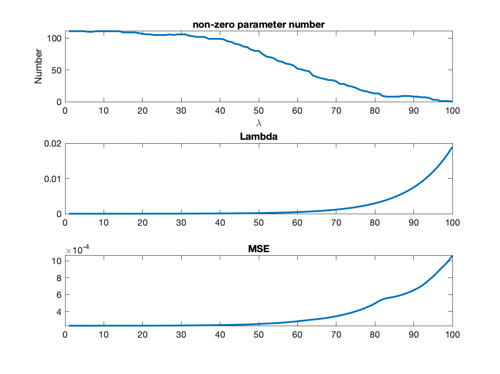
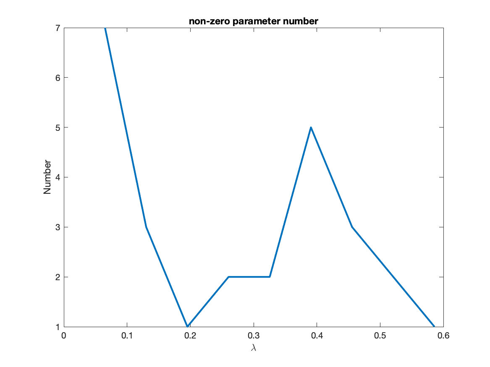
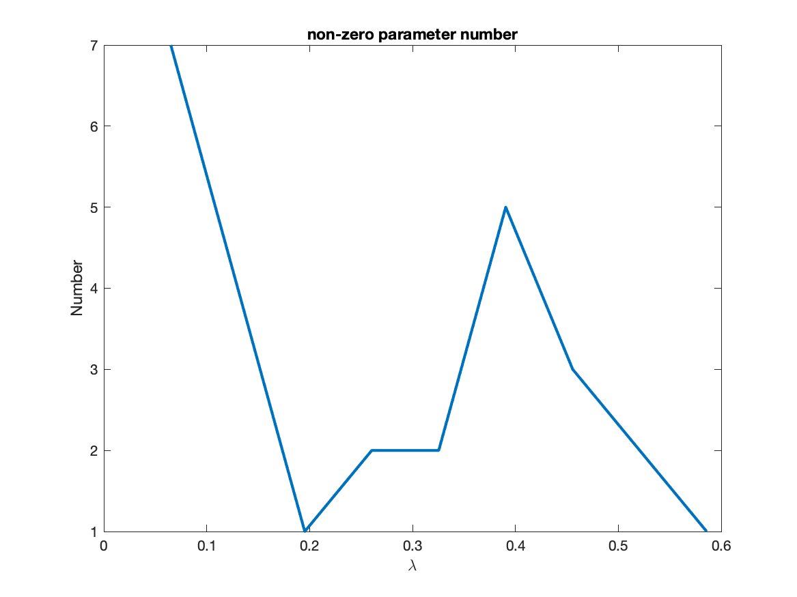
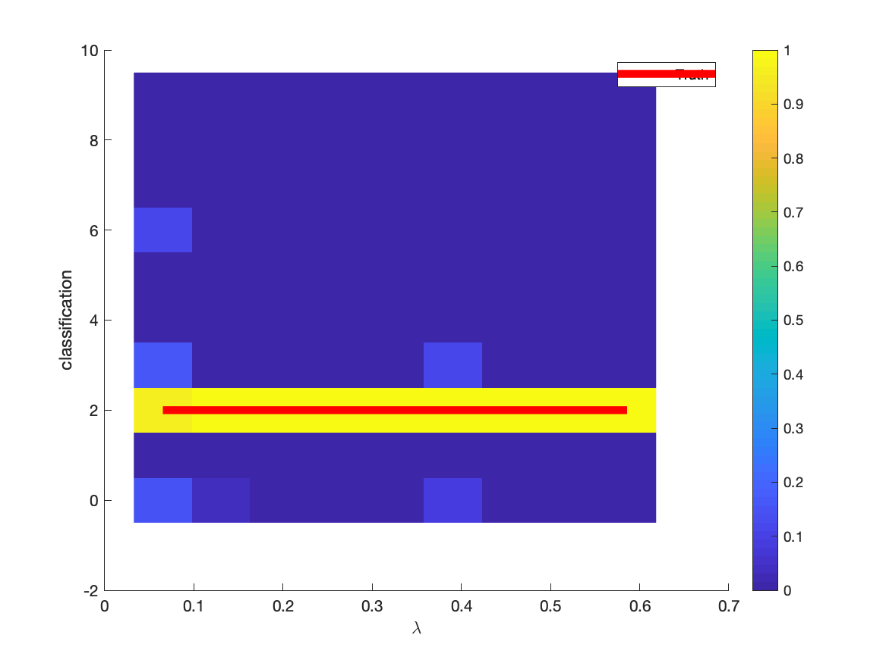
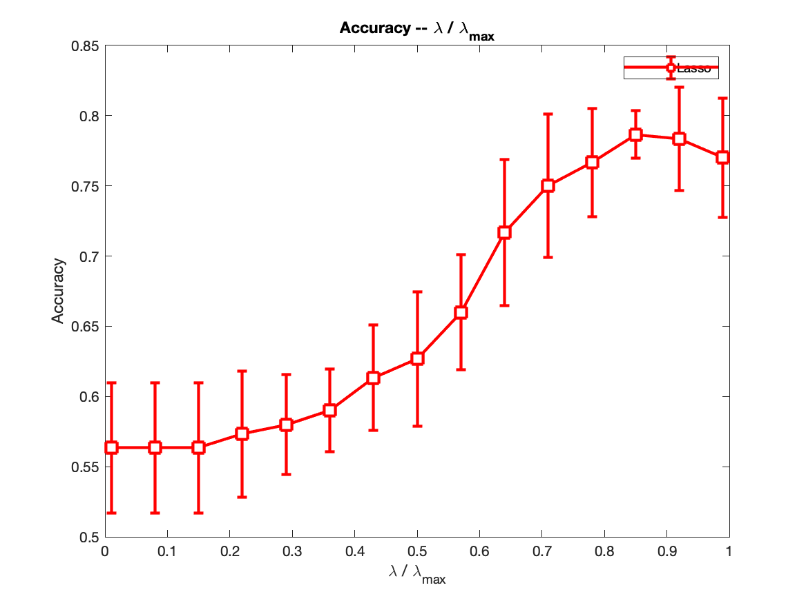

# sbl_screening

#### Lasso




#### PanWei




#### PanWei Screen Test





#### Accuracy



## Denoise

#### Generate simulation data

```
cd sampling
python simulation_dataset.py
cd ..
```

#### Run

```
python denoise.py
```

